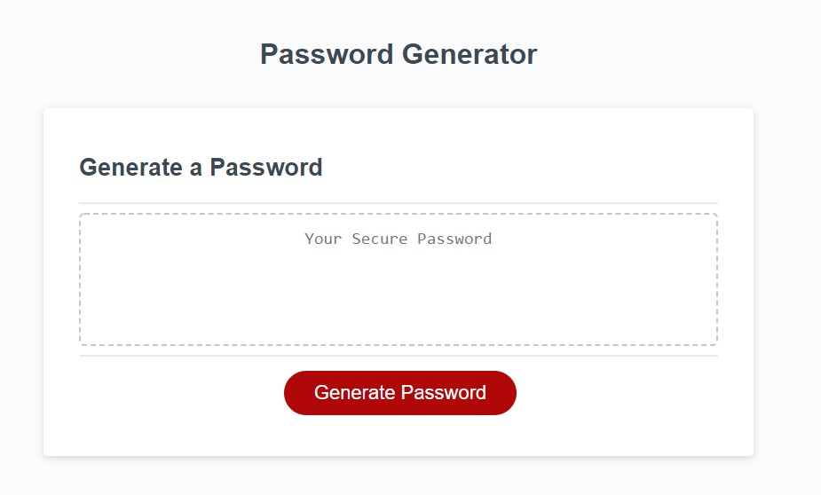
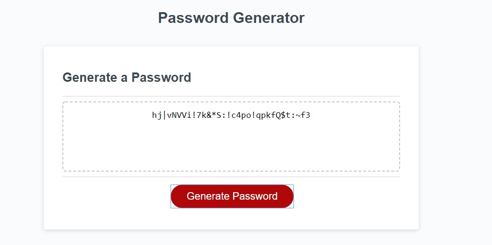

# Password Generator Javascript

Homework Week 3

Deployed Site URL : https://chrisamk.github.io/Password-Generator-Javascript/index.html

For this weeks homework we were required to create a Random Password Generator using Javascript, the HTML was all provided. The main criteria to be submit were that the password was randomly generated with the help of Math.random. The webpage prompts the user on how long the user wants their password while having to stay within 8 to 128 characters. This was achieved with a For loop where the code loops the amount of times the user inputs. The user has the option to include Lowercase, Uppercase, Numeric and Special Numbers and has to be checked to make sure atleast one option is chosen. If all Criteria is met, Javascript will then output the Password into the Text Area provided in the HTML Document.

I suspect my Code will look very different to others as i did this completely off the top of my head, i heard alot of people talking about using the Concat function but i used a different system where i made a variable called pSelection and depending on user input the pSelection was equal to whatever the user selected they want in their password. I set it up this way to ensure all ways possible user combinations can be achieved with IF statements.

GitHub Repo Link : https://github.com/ChrisAMK/Password-Generator-Javascript

GitHub Repo Clone Link : https://github.com/ChrisAMK/Password-Generator-Javascript.git

